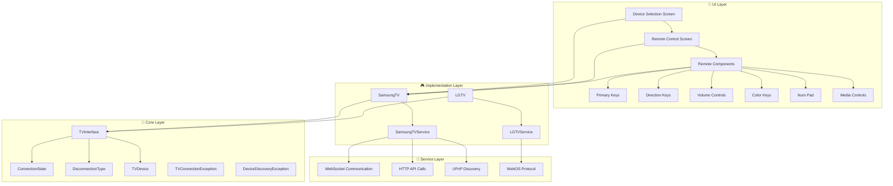
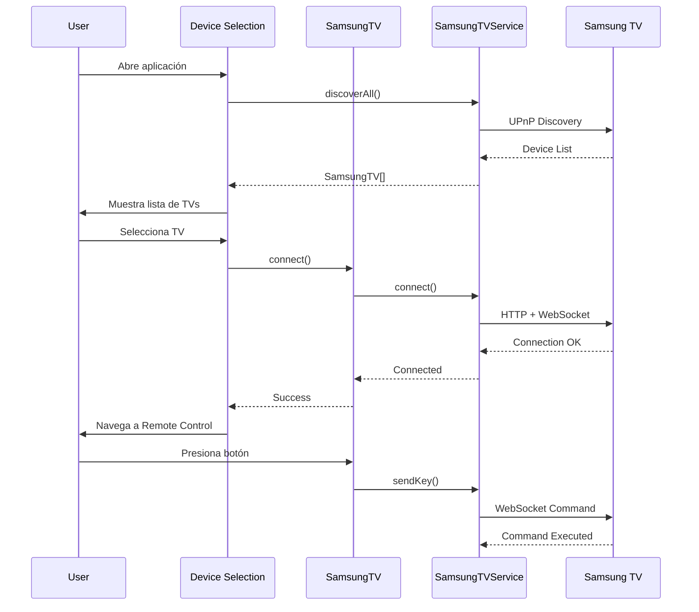
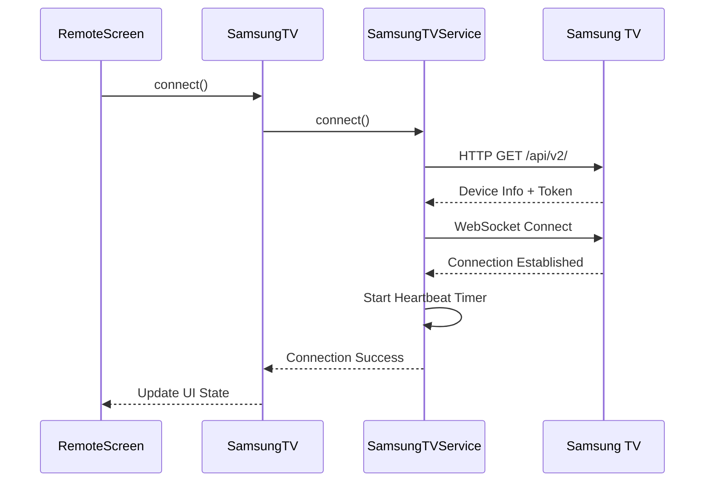
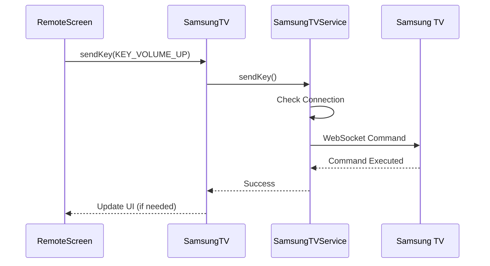
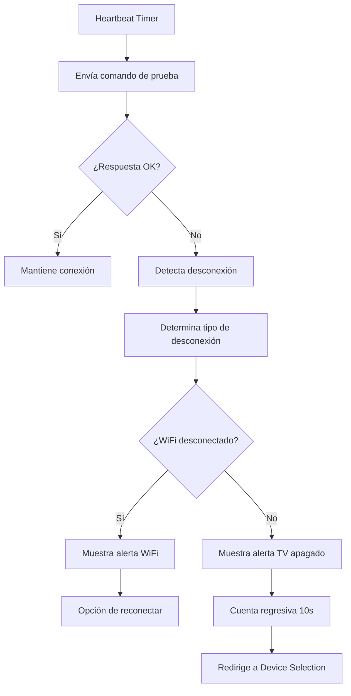
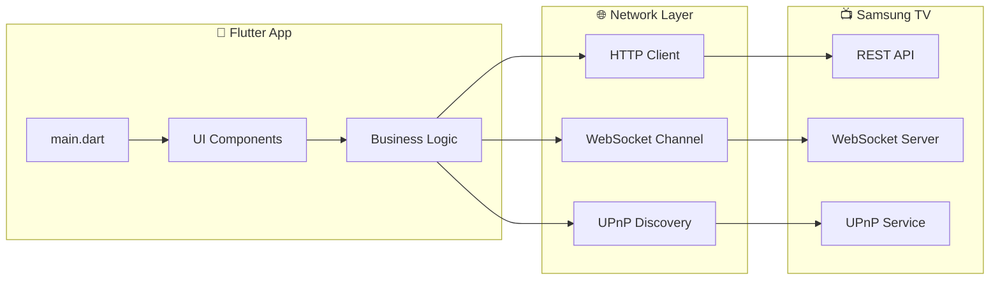
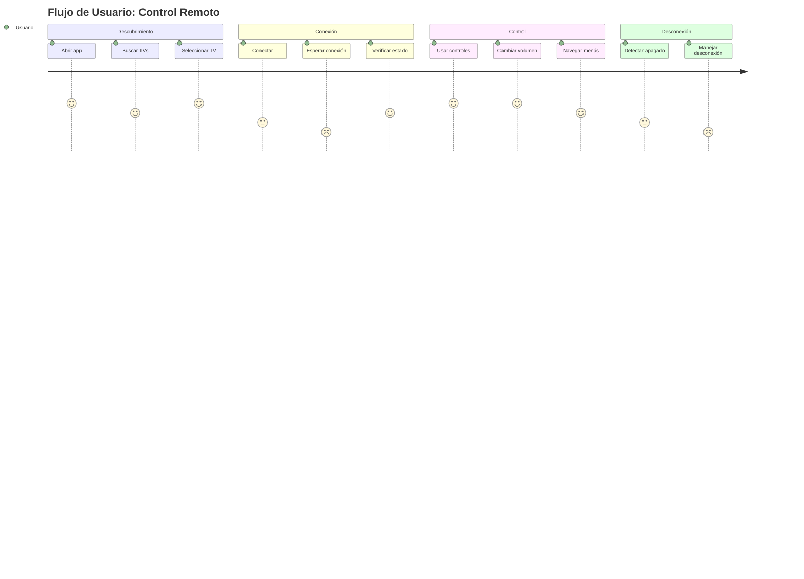
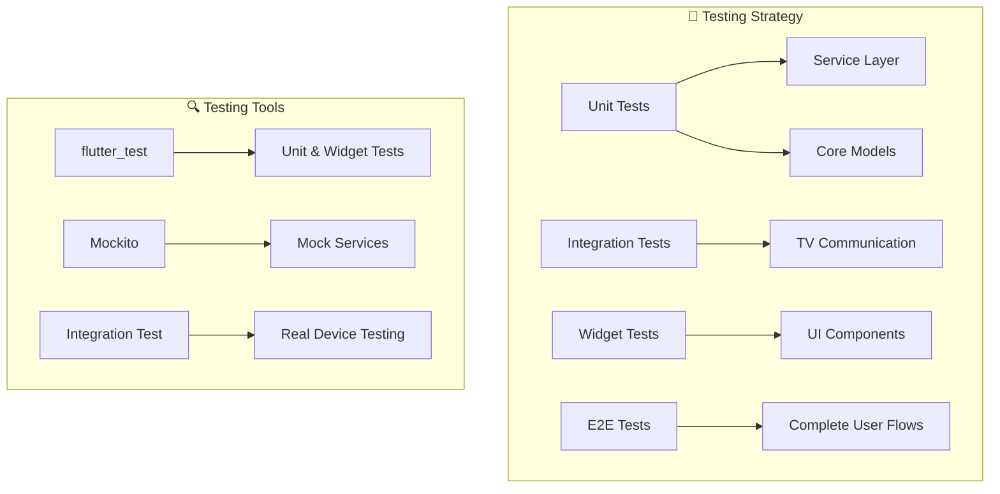
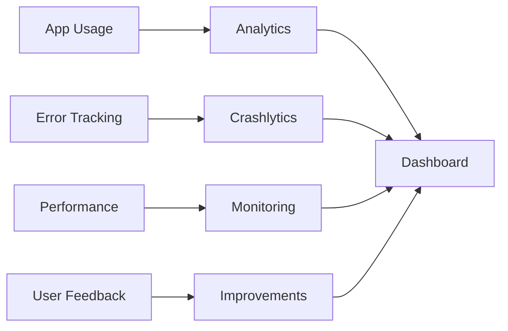

# 📱 Smart TV Remote Control

Una aplicación Flutter avanzada para controlar televisores Samsung y LG de forma remota a través de la red WiFi local.

## 🎯 Descripción del Proyecto

Esta aplicación permite descubrir, conectar y controlar televisores inteligentes Samsung y LG desde tu dispositivo móvil Android/iOS. Utiliza protocolos UPnP para el descubrimiento de dispositivos, WebSocket para comunicación en tiempo real con Samsung TVs, y está re - diseñada con una arquitectura mas escalable que la version principal para soportar múltiples marcas de televisores.

### ✨ Características Principales

- 🔍 **Descubrimiento Automático**: Encuentra TVs Samsung en la red local
- 🔗 **Conexión Inteligente**: Conecta automáticamente con autenticación
- 🎮 **Control Completo**: Botones de navegación, volumen, canales, colores y teclado numérico
- ⚡ **Desconexión Inteligente**: Detecta cuando el TV se apaga o se pierde la conexión WiFi
- 🔄 **Reconexión Automática**: Opción de reconectar fácilmente
- 📱 **UI Moderna**: Interfaz intuitiva con diseño Material Design (va a cambiar con el tiempo)

## 🏗️ Arquitectura del Sistema

### 📊 Diagrama de Arquitectura General



### 🔄 Flujo de Datos



## 📁 Estructura del Proyecto

```
lib/
├── 📁 core/                           # 🎯 CAPA CORE - Sin dependencias externas
│   ├── 📁 interfaces/
│   │   └── tv_interface.dart          # Contrato base para todas las TVs
│   ├── 📁 models/
│   │   ├── tv_device.dart             # Modelo de dispositivo TV
│   │   ├── connection_state.dart      # Estados de conexión
│   │   └── disconnection_type.dart    # Tipos de desconexión
│   └── 📁 exceptions/
│       ├── tv_connection_exception.dart    # Excepciones de conexión
│       └── device_discovery_exception.dart # Excepciones de descubrimiento
│
├── 📁 services/                       # 🔧 CAPA DE SERVICIOS - Lógica de negocio
│   └── 📁 samsung/
│       └── samsung_tv_service.dart    # Servicio específico Samsung
│
├── 📁 implementations/                # 🎮 CAPA DE IMPLEMENTACIONES - Adaptadores
│   ├── samsung_tv.dart               # Implementación Samsung
│   └── lg_tv.dart                     # Implementación LG (placeholder)
│
├── 📁 ui/                            # 📱 CAPA DE UI - Interfaz de usuario
│   ├── 📁 screens/
│   │   ├── 📁 device_selection/
│   │   │   └── device_selection_screen.dart
│   │   └── 📁 remote_control/
│   │       └── remote_screen.dart
│   └── 📁 widgets/
│       └── 📁 remote_controls/
│           └── 📁 components/
│               ├── primary_keys.dart
│               ├── direction_keys.dart
│               ├── volume_channel.dart
│               ├── color_keys.dart
│               ├── num_pad.dart
│               ├── media_controls.dart
│               └── controller_button.dart
│
└── 📁 constants/                     # 📋 Constantes globales
    ├── key_codes.dart                # Códigos de teclas Samsung
    └── app_colors.dart               # Paleta de colores
```

## 🔧 Componentes de la Arquitectura

### 🎯 Core Layer (Capa Central)

**Propósito**: Define contratos y modelos fundamentales sin dependencias externas.

#### `TVInterface`
```dart
abstract class TVInterface {
  // Propiedades básicas
  String? get host;
  String? get mac;
  String? get deviceName;
  String? get modelName;
  
  // Estado de conexión
  bool get isConnected;
  ConnectionState get connectionState;
  
  // Métodos principales
  Future<void> connect({String appName});
  void disconnect();
  Future<void> sendKey(KeyCodes key);
  void setOnDisconnectedCallback(Function(DisconnectionType) callback);
}
```

**¿Por qué existe?**
- Define un contrato común para todas las marcas de TV
- Permite polimorfismo y extensibilidad
- Facilita testing con mocks
- Centraliza la interfaz de comunicación

#### `ConnectionState` & `DisconnectionType`
```dart
enum ConnectionState {
  connected, disconnected, connecting, error, unknown
}

enum DisconnectionType {
  wifiDisconnected, tvPowerOff, unknown
}
```

**¿Por qué existen?**
- Tipado fuerte para estados de conexión
- Diferenciación clara entre tipos de desconexión
- Mejor manejo de errores y UX

### 🔧 Service Layer (Capa de Servicios)

**Propósito**: Contiene la lógica de negocio específica para cada marca de TV.

#### `SamsungTVService`
```dart
class SamsungTVService {
  // WebSocket para comandos en tiempo real
  IOWebSocketChannel? ws;
  
  // HTTP para información del dispositivo
  Future<Response> getDeviceInfo();
  
  // UPnP para descubrimiento
  static Future<List<SamsungTVService>> discoverAll();
  
  // Heartbeat para mantener conexión
  Timer? _heartbeatTimer;
}
```

**¿Por qué existe?**
- Separa la lógica específica de Samsung del modelo
- Reutilizable por diferentes implementaciones
- Fácil testing independiente
- Encapsula protocolos complejos (WebSocket, UPnP, HTTP)

**Funcionalidades Clave:**
- **UPnP Discovery**: Encuentra TVs Samsung en la red
- **WebSocket Communication**: Envía comandos en tiempo real
- **Heartbeat System**: Mantiene la conexión activa
- **Disconnection Detection**: Detecta cuando el TV se apaga
- **Error Handling**: Maneja errores de red y conexión

### 🎮 Implementation Layer (Capa de Implementaciones)

**Propósito**: Actúa como adaptador entre la interfaz y el servicio específico.

#### `SamsungTV`
```dart
class SamsungTV implements TVInterface {
  final SamsungTVService _service;
  
  // Delega todas las llamadas al servicio
  @override
  Future<void> connect({String appName}) => _service.connect(appName: appName);
  
  @override
  Future<void> sendKey(KeyCodes key) => _service.sendKey(key);
}
```

**¿Por qué existe?**
- Implementa `TVInterface` de forma consistente
- Delega lógica compleja al servicio
- Permite agregar lógica específica de la implementación
- Facilita el cambio de servicios sin afectar la UI

#### `LGTV` (Placeholder)
```dart
class LGTV implements TVInterface {
  // Implementación placeholder para WebOS
  // TODO: Implementar protocolo LG WebOS
}
```

**¿Por qué existe?**
- Demuestra la extensibilidad de la arquitectura
- Prepara el terreno para futuras implementaciones
- Mantiene consistencia en la interfaz

### 📱 UI Layer (Capa de Interfaz)

**Propósito**: Maneja la presentación y interacción del usuario.

#### Pantallas Principales

**`DeviceSelectionScreen`**
- Descubre TVs disponibles en la red
- Muestra lista con información del dispositivo
- Maneja estados de WiFi desconectado
- Conecta al dispositivo seleccionado

**`RemoteScreen`**
- Interfaz principal del control remoto
- Muestra estado de conexión en tiempo real
- Maneja desconexiones y reconexiones
- Contiene todos los controles del TV

#### Componentes de Control

**`PrimaryKeys`**: Botones principales (Power, Home, Back)
**`DirectionKeys`**: Navegación direccional (Up, Down, Left, Right, OK)
**`VolumeChannelControls`**: Control de volumen y canales
**`ColorKeys`**: Botones de colores (Rojo, Verde, Azul, Amarillo)
**`NumPad`**: Teclado numérico para canales
**`MediaControls`**: Controles multimedia (Play, Pause, Stop, etc.)

## 🔄 Flujos de Trabajo

### 1. Descubrimiento de Dispositivos

```mermaid
flowchart TD
    A[Usuario abre app] --> B[DeviceSelectionScreen]
    B --> C[Inicia UPnP Discovery]
    C --> D[Busca dispositivos Samsung]
    D --> E{¿Encontró dispositivos?}
    E -->|Sí| F[Muestra lista de TVs]
    E -->|No| G[Muestra mensaje "No encontrados"]
    F --> H[Usuario selecciona TV]
    H --> I[Conecta al dispositivo]
    I --> J[Navega a RemoteScreen]
```

### 2. Proceso de Conexión



### 3. Envío de Comandos



### 4. Detección de Desconexión



## 📦 Dependencias y sus Propósitos

### Dependencias Principales

| Dependencia | Versión | Propósito | Uso en el Proyecto |
|-------------|---------|-----------|-------------------|
| `flutter` | 3.32.6 | Framework base | UI, navegación, estado |
| `http` | 1.5.0 | Cliente HTTP | Comunicación con API Samsung |
| `web_socket_channel` | 2.4.5 | WebSocket | Comandos en tiempo real |
| `upnp2` | 3.0.12 | UPnP Discovery | Encontrar TVs en la red |

### Dependencias de Desarrollo

| Dependencia | Versión | Propósito |
|-------------|---------|-----------|
| `flutter_test` | 0.0.0 | Testing framework |
| `flutter_lints` | 3.0.2 | Linting rules |

### Análisis de Dependencias



## 🎯 Ventajas de la Arquitectura

### ✅ Escalabilidad
- **Fácil agregar nuevas marcas**: Solo crear nuevo Service + Implementation
- **Modular**: Cada capa tiene responsabilidades claras
- **Extensible**: Interfaces permiten nuevas funcionalidades

### ✅ Mantenibilidad
- **Separación de responsabilidades**: Cada clase tiene un propósito específico
- **Bajo acoplamiento**: Las capas no dependen de implementaciones específicas
- **Alto cohesión**: Funcionalidades relacionadas están agrupadas

### ✅ Testabilidad
- **Interfaces mockeables**: Fácil crear mocks para testing
- **Servicios aislados**: Cada servicio se puede testear independientemente
- **UI desacoplada**: La UI no depende de implementaciones específicas

### ✅ Reutilización
- **Servicios reutilizables**: `SamsungTVService` puede ser usado por diferentes implementaciones
- **Componentes UI modulares**: Los componentes de control son reutilizables
- **Lógica centralizada**: Evita duplicación de código

## ⚠️ Desventajas y Limitaciones

### ❌ Complejidad Inicial
- **Curva de aprendizaje**: Requiere entender múltiples capas
- **Overhead**: Más archivos y abstracciones para casos simples
- **Documentación**: Necesita documentación detallada para nuevos desarrolladores

### ❌ Limitaciones Técnicas
- **Protocolos específicos**: Samsung usa protocolos propietarios
- **Dependencia de red**: Requiere WiFi estable
- **Compatibilidad**: Solo funciona con TVs Samsung compatibles

### ❌ Mantenimiento
- **Múltiples puntos de falla**: Cada capa puede tener errores
- **Sincronización**: Cambios en interfaces requieren actualizar implementaciones
- **Debugging**: Errores pueden estar en múltiples capas

## 🚀 Casos de Uso y Escenarios

### 📱 Caso de Uso Principal: Control Remoto Básico



### 🔄 Caso de Uso: Reconexión Automática

1. **Usuario pierde WiFi**
   - App detecta desconexión instantáneamente
   - Muestra alerta específica de WiFi
   - Ofrece opción de reconectar

2. **TV se apaga**
   - App detecta desconexión del WebSocket
   - Muestra alerta de TV apagado
   - Cuenta regresiva de 10 segundos
   - Redirige a selección de dispositivos

3. **Reconexión exitosa**
   - App intenta reconectar automáticamente
   - Verifica estado del TV
   - Restaura conexión si es posible

## 🛠️ Instalación y Configuración

### Prerrequisitos
- Flutter SDK 3.32.6+
- Dart SDK 3.8.1+
- Android Studio / VS Code
- Dispositivo Android/iOS para testing
- Samsung TV compatible en la misma red WiFi

### Pasos de Instalación

1. **Clonar el repositorio**
```bash
git clone https://github.com/tu-usuario/smart-tv-remote-control.git
cd smart-tv-remote-control
```

2. **Instalar dependencias**
```bash
flutter pub get
```

3. **Configurar dispositivo**
```bash
flutter devices
flutter run
```

### Configuración del TV Samsung

1. **Habilitar Smart View**
   - Ir a Settings > General > External Device Manager
   - Habilitar "Device Connect Manager"
   - Habilitar "Access Notification"

2. **Configurar red**
   - Asegurar que TV y dispositivo móvil estén en la misma red WiFi
   - Verificar que no hay firewall bloqueando puertos 8001 y 8002

## 🧪 Testing y Debugging

### Estrategia de Testing



### Debugging Tips

1. **Logs de Conexión**
```dart
// Habilitar logs detallados
import 'dart:developer' as developer;
developer.log('Connection attempt', name: 'TVConnection');
```

2. **Verificar Estado de Red**
```dart
// Verificar conectividad WiFi
final connectivity = await Connectivity().checkConnectivity();
```

3. **Debug WebSocket**
```dart
// Monitorear mensajes WebSocket
ws.stream.listen((data) {
  print('WebSocket received: $data');
});
```

## 🔮 Roadmap y Futuras Mejoras

### 🎯 Funcionalidades Planificadas

- [ ] **Soporte para LG WebOS**: Implementar protocolo LG completo
- [ ] **Soporte para Sony Bravia**: Agregar compatibilidad con TVs Sony
- [ ] **Control de Apps**: Lanzar aplicaciones específicas
- [ ] **Grabación de Macros**: Secuencias de comandos personalizables
- [ ] **Modo Oscuro**: Tema oscuro para la aplicación
- [ ] **Widgets**: Widgets de acceso rápido para Android
- [ ] **Compartir Dispositivos**: Múltiples usuarios controlando el mismo TV

### 🏗️ Mejoras Arquitecturales

- [ ] **Dependency Injection**: Implementar inyección de dependencias
- [ ] **State Management**: Migrar a Bloc/Riverpod para estado global
- [ ] **Offline Mode**: Cache de dispositivos para uso offline
- [ ] **Analytics**: Tracking de uso y errores
- [ ] **CI/CD**: Pipeline de integración continua

### 📊 Métricas y Monitoreo



## 🤝 Contribución

### Cómo Contribuir

1. **Fork del repositorio**
2. **Crear branch de feature**: `git checkout -b feature/nueva-funcionalidad`
3. **Hacer cambios**: Seguir las convenciones de código
4. **Tests**: Asegurar que todos los tests pasen
5. **Pull Request**: Describir cambios y casos de uso

### Convenciones de Código

- **Naming**: camelCase para variables, PascalCase para clases
- **Documentación**: Comentarios JSDoc para métodos públicos
- **Testing**: Cobertura mínima del 80%
- **Commits**: Mensajes descriptivos siguiendo Conventional Commits

### Estructura de Commits

```
feat: agregar soporte para LG WebOS
fix: corregir detección de desconexión WiFi
docs: actualizar documentación de API
test: agregar tests para SamsungTVService
refactor: reorganizar estructura de carpetas
```

## 📄 Licencia

Este proyecto está bajo la Licencia MIT. Ver `LICENSE` para más detalles.

## 🙏 Agradecimientos

- **Samsung**: Por la documentación de Smart View API
- **Flutter Team**: Por el excelente framework
- **Comunidad UPnP**: Por las librerías de descubrimiento
- **Contribuidores**: Por las mejoras y reportes de bugs

## 📞 Soporte

- **Issues**: escribirme xD

---

**Desarrollado con ❤️ usando Flutter**