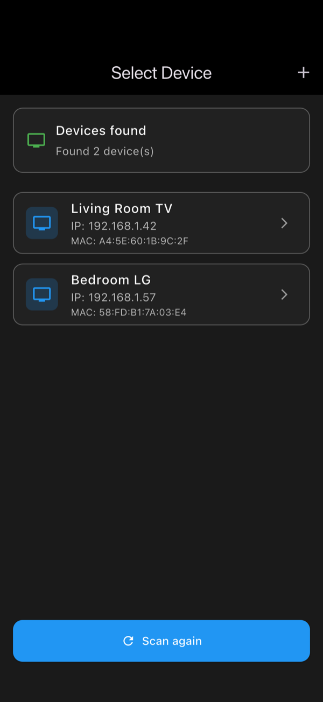
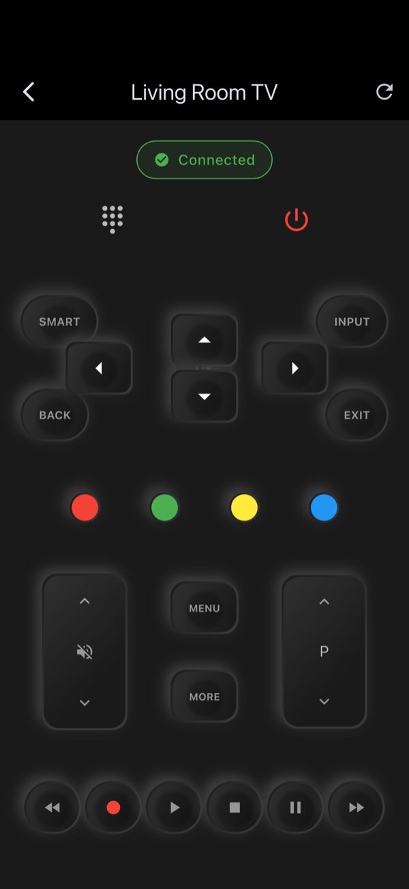
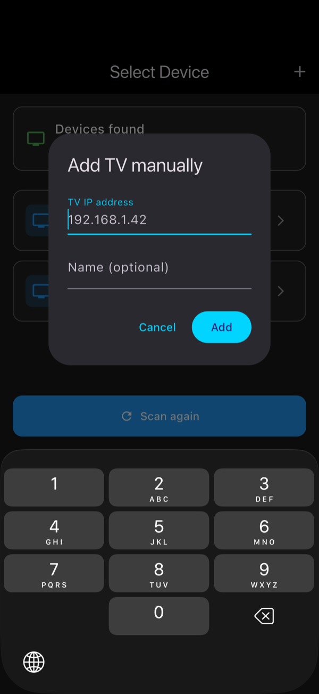

# Smart TV Remote Control

> Universal Flutter remote for Samsung Tizen and LG WebOS TVs — discovery, control, and reconnect without the original remote.

[](https://github.com/mazen-salah/Smart-TV-Remote-Control/actions/workflows/ci.yml)
[](https://github.com/mazen-salah/Smart-TV-Remote-Control/releases/latest)
[](LICENSE)

[](CONTRIBUTING.md)

---

## Screenshots

| Device picker | Remote | Manual IP dialog |
| :---: | :---: | :---: |
|  |  |  |

---

## Download

- **Android:** grab the signed APK from the
  [latest release](https://github.com/mazen-salah/Smart-TV-Remote-Control/releases/latest).
  Most phones want the `arm64-v8a` build; pick `universal` if unsure. Your
  phone will ask you to allow installs from this source the first time.
- **iOS:** not on TestFlight yet. Build from source with the
  [Quickstart](#quickstart) below.

---

## Features

### Discovery
- Parallel SSDP (UPnP) and Bonjour/mDNS sweeps. mDNS goes through the platform's own service browser, so it works on iOS without Apple's multicast entitlement and on Android without extra setup; SSDP holds an Android `MulticastLock` while it runs
- AirPlay and Cast advertisements are inspected for the manufacturer, so an LG or Samsung set that only announces those still shows up, while Apple TVs and Chromecasts are filtered out
- Manual IP entry as a fallback when the TV refuses to broadcast
- Known-TV memory: previously paired sets are remembered and auto-connected on next launch

### Connectivity
- Real network state via `connectivity_plus` (no DNS polling)
- Native WebSocket `pingInterval`-based heartbeat (no manual 500 ms / 5 s timer loops)
- Wake-on-LAN: when a known TV refuses the connection, the app sends a magic packet and retries once
- Samsung pairing token persisted locally — the on-TV "Allow" popup only appears the first time

### Brands
- **Samsung Tizen** — WebSocket v2 (`wss://`) client in `lib/services/samsung/samsung_tv_service.dart`, tested on real hardware
- **LG webOS** — WebSocket client in `lib/services/lg/lg_tv_service.dart` using the secure port newer firmware requires (2023+), LG's signed pairing manifest, the pointer-input socket for navigation, colour and digit keys, and `media.controls` for transport. **Not yet verified on a real LG set**. If you own one, [we would love your test report](https://github.com/mazen-salah/Smart-TV-Remote-Control/issues?q=is%3Aissue+label%3A%22help+wanted%22).
- **Manual IP entry** — add a Samsung or LG TV by address when discovery misses it

### UX
- Material 3 dark theme
- Haptic feedback on every key press
- `Semantics` labels on every button (screen-reader friendly)
- Localized: English, Spanish, Arabic (ARB files under `lib/l10n/`)

---

## Supported TVs

| Brand | Models | Protocol | Notes |
| --- | --- | --- | --- |
| Samsung | 2016+ Tizen | WebSocket v2 (`wss://<ip>:8002`) | Token saved after first "Allow". Tested. |
| LG | webOS 3.0+ | WebSocket (`wss://<ip>:3001`, falls back to `ws://<ip>:3000`) | Client-key pairing persisted. Needs hardware testing. Not mapped yet: input source, tools, guide, more, record. |

Sony Bravia, Roku, Android TV and others are not supported yet. See the
[roadmap](#roadmap--known-limitations).

---

## Quickstart

```bash
git clone https://github.com/mazen-salah/Smart-TV-Remote-Control.git
cd Smart-TV-Remote-Control
flutter pub get
flutter run
```

Requirements:

- Flutter `>= 3.47.0` (the Android project uses Gradle 9.3 and AGP 9.1, which older Flutter Gradle plugins cannot drive)
- Phone and TV must be on the same Wi-Fi / VLAN
- On Android 13+ grant the **Local Network** / nearby-devices permission when prompted

---

## Architecture

```
┌─────────────────────────────────────────────────────┐
│  UI  (screens, widgets)                             │
│   - DeviceSelectionScreen                           │
│   - RemoteScreen                                    │
│   - ManualIpDialog                                  │
└───────────────▲─────────────────────────────────────┘
                │ BlocBuilder / BlocListener
┌───────────────┴─────────────────────────────────────┐
│  Bloc layer   (lib/blocs/)                          │
│   - TvConnectionBloc                                │
│   - DeviceDiscoveryBloc                             │
│   - ConnectivityCubit                               │
└───────────────▲─────────────────────────────────────┘
                │ calls
┌───────────────┴─────────────────────────────────────┐
│  Repository layer  (lib/core/repositories/)         │
│   - TvRepository   (picks SamsungTV or LGTV by      │
│                     manufacturer, owns the session) │
│   - KnownTvsStorage / TvTokenStorage                │
│   - WakeOnLanService  (lib/core/services/)          │
└───────────────▲─────────────────────────────────────┘
                │ delegates to
┌───────────────┴─────────────────────────────────────┐
│  Service layer  (lib/services/, lib/implementations)│
│   - samsung/samsung_tv_service.dart (WSS v2)        │
│   - lg/lg_tv_service.dart           (webOS wss)     │
│   - upnp/ssdp_discovery_service.dart (SSDP, both)   │
│   - mdns/bonjour_discovery_service.dart (Bonjour)   │
└───────────────▲─────────────────────────────────────┘
                │ TCP / UDP / WebSocket
┌───────────────┴─────────────────────────────────────┐
│  TV  (Samsung Tizen / LG WebOS / other)             │
└─────────────────────────────────────────────────────┘
```

DI is wired with `get_it` in `lib/di/service_locator.dart`. Blocs depend on repositories; repositories depend on services. UI never touches a service directly.

The wire protocols themselves (Samsung WebSocket v2 pairing, LG webOS registration and the pointer socket, SSDP and Bonjour discovery) are written up in [docs/protocols.md](docs/protocols.md).

---

## Troubleshooting

**TV not found**
- Confirm the phone and TV share the same Wi-Fi SSID and are not on isolated guest / IoT VLANs.
- On Android 13+, accept the local-network permission prompt — without it mDNS and UPnP both fail silently.
- Try **Add manually by IP** from the device picker. The TV's IP is usually under *Settings → Network → Status*.

**"Allow" popup never appears on Samsung**
- The TV may already have your token cached but blocked it. On the TV: *Settings → General → External Device Manager → Device Connection Manager → Access Notification* → set to **First time only**, then delete this phone from *Device List* and reconnect.
- Clear app data to drop the stored token and force a fresh handshake.

**Won't reconnect after the TV sleeps**
- This is what Wake-on-LAN is for. Open *Settings → General → Network → Expert Settings* on the TV and enable **Power On with Mobile**. The app stores the MAC on first connection and will fire a magic packet on the next attempt.
- If WoL still fails, the TV is likely on a different subnet from your phone — magic packets do not cross routers.

---

## Roadmap / Known limitations

Each planned item is tracked as a GitHub issue; pick one up if it interests you.

- LG WebOS verification on real hardware — help wanted
- Hardware volume-button capture (Android `MediaSession` / iOS `MPRemoteCommandCenter`) — not yet wired
- App launcher (Netflix, YouTube, Disney+ deep links) — protocol supports it, UI pending
- Swipe trackpad for cursor-style WebOS navigation — planned
- Sony Bravia (IRCC-IP) and Roku (ECP) — not implemented
- iOS TestFlight distribution — not yet set up

Known limitation: iOS background reconnect is best-effort, the system may suspend the socket.

---

## Contributing

Pull requests welcome. See [CONTRIBUTING.md](CONTRIBUTING.md) for setup, code style, and the commit convention, and [CODE_OF_CONDUCT.md](CODE_OF_CONDUCT.md) for community expectations. Security issues go through [SECURITY.md](SECURITY.md). The app collects no data; see [PRIVACY.md](PRIVACY.md).

If you have a TV the app does not handle yet, an issue with the brand, model and firmware year is the most useful thing you can send.

## License

MIT — see [LICENSE](LICENSE).
