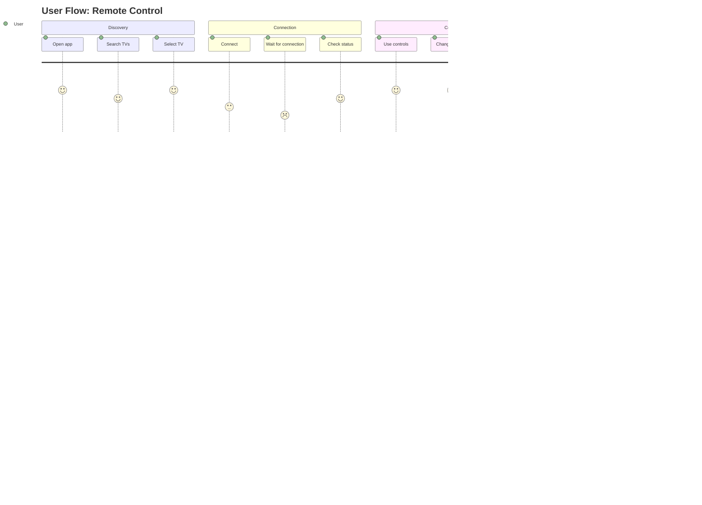

# 📱 Smart TV Remote Control

An advanced Flutter application to remotely control Samsung and LG TVs over the local WiFi network.

## 🎯 Project Description

This app allows you to discover, connect, and control Samsung and LG smart TVs from your Android/iOS mobile device. It uses UPnP protocols for device discovery, WebSocket for real-time communication with Samsung TVs, and is redesigned with a more scalable architecture than the main version to support multiple TV brands.

### ✨ Main Features

- 🔍 **Automatic Discovery**: Finds Samsung TVs on the local network
- 🔗 **Smart Connection**: Connects automatically with authentication
- 🎮 **Full Control**: Navigation buttons, volume, channels, color keys, and numeric keypad
- ⚡ **Smart Disconnection**: Detects when the TV turns off or WiFi connection is lost
- 🔄 **Automatic Reconnection**: Option to easily reconnect
- 📱 **Modern UI**: Intuitive interface with Material Design (will change over time)

## 🏗️ System Architecture

### 📊 General Architecture Diagram


### 🔄 Data Flow


## 📁 Project Structure

```
lib/
├── 📁 core/                           # 🎯 CORE LAYER - No external dependencies
│   ├── 📁 interfaces/
│   │   └── tv_interface.dart          # Base contract for all TVs
│   ├── 📁 models/
│   │   ├── tv_device.dart             # TV device model
│   │   ├── connection_state.dart      # Connection states
│   │   └── disconnection_type.dart    # Disconnection types
│   └── 📁 exceptions/
│       ├── tv_connection_exception.dart    # Connection exceptions
│       └── device_discovery_exception.dart # Discovery exceptions
│
├── 📁 services/                       # 🔧 SERVICE LAYER - Business logic
│   └── 📁 samsung/
│       └── samsung_tv_service.dart    # Samsung-specific service
│
├── 📁 implementations/                # 🎮 IMPLEMENTATION LAYER - Adapters
│   ├── samsung_tv.dart                # Samsung implementation
│   └── lg_tv.dart                     # LG implementation (placeholder)
│
├── 📁 ui/                             # 📱 UI LAYER - User interface
│   ├── 📁 screens/
│   │   ├── 📁 device_selection/
│   │   │   └── device_selection_screen.dart
│   │   └── 📁 remote_control/
│   │       └── remote_screen.dart
│   └── 📁 widgets/
│       └── 📁 remote_controls/
│           └── 📁 components/
│               ├── primary_keys.dart
│               ├── direction_keys.dart
│               ├── volume_channel.dart
│               ├── color_keys.dart
│               ├── num_pad.dart
│               ├── media_controls.dart
│               └── controller_button.dart
│
└── 📁 constants/                      # 📋 Global constants
    ├── key_codes.dart                 # Samsung key codes
    └── app_colors.dart                # Color palette
```

## 🔧 Architecture Components

### 🎯 Core Layer

**Purpose**: Defines fundamental contracts and models with no external dependencies.

#### `TVInterface`
```dart
abstract class TVInterface {
  // Basic properties
  String? get host;
  String? get mac;
  String? get deviceName;
  String? get modelName;
  
  // Connection state
  bool get isConnected;
  ConnectionState get connectionState;
  
  // Main methods
  Future<void> connect({String appName});
  void disconnect();
  Future<void> sendKey(KeyCodes key);
  void setOnDisconnectedCallback(Function(DisconnectionType) callback);
}
```

**Why does it exist?**
- Defines a common contract for all TV brands
- Enables polymorphism and extensibility
- Facilitates testing with mocks
- Centralizes the communication interface

#### `ConnectionState` & `DisconnectionType`
```dart
enum ConnectionState {
  connected, disconnected, connecting, error, unknown
}

enum DisconnectionType {
  wifiDisconnected, tvPowerOff, unknown
}
```

**Why do they exist?**
- Strong typing for connection states
- Clear differentiation between disconnection types
- Better error handling and UX

### 🔧 Service Layer

**Purpose**: Contains business logic specific to each TV brand.

#### `SamsungTVService`
```dart
class SamsungTVService {
  // WebSocket for real-time commands
  IOWebSocketChannel? ws;
  
  // HTTP for device info
  Future<Response> getDeviceInfo();
  
  // UPnP for discovery
  static Future<List<SamsungTVService>> discoverAll();
  
  // Heartbeat to keep connection alive
  Timer? _heartbeatTimer;
}
```

**Why does it exist?**
- Separates Samsung-specific logic from the model
- Reusable by different implementations
- Easy independent testing
- Encapsulates complex protocols (WebSocket, UPnP, HTTP)

**Key Features:**
- **UPnP Discovery**: Finds Samsung TVs on the network
- **WebSocket Communication**: Sends real-time commands
- **Heartbeat System**: Keeps the connection active
- **Disconnection Detection**: Detects when the TV turns off
- **Error Handling**: Handles network and connection errors

### 🎮 Implementation Layer

**Purpose**: Acts as an adapter between the interface and the specific service.

#### `SamsungTV`
```dart
class SamsungTV implements TVInterface {
  final SamsungTVService _service;
  
  // Delegates all calls to the service
  @override
  Future<void> connect({String appName}) => _service.connect(appName: appName);
  
  @override
  Future<void> sendKey(KeyCodes key) => _service.sendKey(key);
}
```

**Why does it exist?**
- Implements `TVInterface` consistently
- Delegates complex logic to the service
- Allows adding implementation-specific logic
- Makes it easy to swap services without affecting the UI

#### `LGTV` (Placeholder)
```dart
class LGTV implements TVInterface {
  // Placeholder implementation for WebOS
  // TODO: Implement LG WebOS protocol
}
```

**Why does it exist?**
- Demonstrates the extensibility of the architecture
- Prepares for future implementations
- Maintains interface consistency

### 📱 UI Layer

**Purpose**: Handles user presentation and interaction.

#### Main Screens

**`DeviceSelectionScreen`**
- Discovers available TVs on the network
- Shows a list with device information
- Handles WiFi disconnected states
- Connects to the selected device

**`RemoteScreen`**
- Main remote control interface
- Shows real-time connection status
- Handles disconnections and reconnections
- Contains all TV controls

#### Control Components

**`PrimaryKeys`**: Main buttons (Power, Home, Back)  
**`DirectionKeys`**: Directional navigation (Up, Down, Left, Right, OK)  
**`VolumeChannelControls`**: Volume and channel control  
**`ColorKeys`**: Color buttons (Red, Green, Blue, Yellow)  
**`NumPad`**: Numeric keypad for channels  
**`MediaControls`**: Media controls (Play, Pause, Stop, etc.)

## 🔄 Workflows

### 1. Device Discovery

```mermaid
flowchart TD
    A[User opens app] --> B[DeviceSelectionScreen]
    B --> C[Starts UPnP Discovery]
    C --> D[Searches for Samsung devices]
    D --> E{Devices found?}
    E -->|Yes| F[Shows TV list]
    E -->|No| G[Shows "Not found" message]
    F --> H[User selects TV]
    H --> I[Connects to device]
    I --> J[Navigates to RemoteScreen]
```

### 2. Connection Process


### 3. Sending Commands


### 4. Disconnection Detection


## 📦 Dependencies and Their Purposes

### Main Dependencies

| Dependency | Version | Purpose | Usage in Project |
|------------|---------|---------|------------------|
| `flutter` | 3.32.6 | Base framework | UI, navigation, state |
| `http` | 1.5.0 | HTTP client | Samsung API communication |
| `web_socket_channel` | 2.4.5 | WebSocket | Real-time commands |
| `upnp2` | 3.0.12 | UPnP Discovery | Find TVs on the network |

### Development Dependencies

| Dependency | Version | Purpose |
|------------|---------|---------|
| `flutter_test` | 0.0.0 | Testing framework |
| `flutter_lints` | 3.0.2 | Linting rules |

### Dependency Analysis


## 🎯 Architecture Advantages

### ✅ Scalability
- **Easy to add new brands**: Just create a new Service + Implementation
- **Modular**: Each layer has clear responsibilities
- **Extensible**: Interfaces allow new features

### ✅ Maintainability
- **Separation of concerns**: Each class has a specific purpose
- **Low coupling**: Layers don't depend on specific implementations
- **High cohesion**: Related functionalities are grouped

### ✅ Testability
- **Mockable interfaces**: Easy to create mocks for testing
- **Isolated services**: Each service can be tested independently
- **Decoupled UI**: UI doesn't depend on specific implementations

### ✅ Reusability
- **Reusable services**: `SamsungTVService` can be used by different implementations
- **Modular UI components**: Control components are reusable
- **Centralized logic**: Avoids code duplication

## ⚠️ Desadvantages and Limitations

### ❌ Initial Complexity
- **Learning curve**: Requires understanding multiple layers
- **Overhead**: More files and abstractions for simple cases
- **Documentation**: Needs detailed docs for new developers

### ❌ Technical Limitations
- **Specific protocols**: Samsung uses proprietary protocols
- **Network dependency**: Requires stable WiFi
- **Compatibility**: Only works with compatible Samsung TVs

### ❌ Maintenance
- **Multiple failure points**: Each layer can have errors
- **Synchronization**: Interface changes require updating implementations
- **Debugging**: Errors can be in multiple layers

## 🚀 Use Cases and Scenarios

### 📱 Main Use Case: Basic Remote Control



### 🔄 Use Case: Automatic Reconnection

1. **User loses WiFi**
   - App instantly detects disconnection
   - Shows specific WiFi alert
   - Offers option to reconnect

2. **TV turns off**
   - App detects WebSocket disconnection
   - Shows TV off alert
   - 10-second countdown
   - Redirects to device selection

3. **Successful reconnection**
   - App tries to reconnect automatically
   - Checks TV status
   - Restores connection if possible

## 🛠️ Installation and Setup

### Prerequisites
- Flutter SDK 3.32.6+
- Dart SDK 3.8.1+
- Android Studio / VS Code
- Android/iOS device for testing
- Compatible Samsung TV on the same WiFi network

### Installation Steps

1. **Clone the repository**
```bash
git clone https://github.com/your-username/smart-tv-remote-control.git
cd smart-tv-remote-control
```

2. **Install dependencies**
```bash
flutter pub get
```

3. **Set up device**
```bash
flutter devices
flutter run
```

### Samsung TV Setup

1. **Enable Smart View**
   - Go to Settings > General > External Device Manager
   - Enable "Device Connect Manager"
   - Enable "Access Notification"

2. **Configure network**
   - Ensure TV and mobile device are on the same WiFi network
   - Make sure no firewall is blocking ports 8001 and 8002

## 🧪 Testing and Debugging

### Testing Strategy



```mermaid
graph TB
    subgraph "🧪 Testing Strategy"
        A[Unit Tests] --> B[Service Layer]
        A --> C[Core Models]
        D[Integration Tests] --> E[TV Communication]
        F[Widget Tests] --> G[UI Components]
        H[E2E Tests] --> I[Complete User Flows]
    end
    
    subgraph "🔍 Testing Tools"
        J[flutter_test] --> K[Unit & Widget Tests]
        L[Mockito] --> M[Mock Services]
        N[Integration Test] --> O[Real Device Testing]
    end
```

### Debugging Tips

1. **Connection Logs**
```dart
// Enable detailed logs
import 'dart:developer' as developer;
developer.log('Connection attempt', name: 'TVConnection');
```

2. **Check Network Status**
```dart
// Check WiFi connectivity
final connectivity = await Connectivity().checkConnectivity();
```

3. **Debug WebSocket**
```dart
// Monitor WebSocket messages
ws.stream.listen((data) {
  print('WebSocket received: $data');
});
```

## 🔮 Roadmap and Future Improvements

### 🎯 Planned Features

- [ ] **LG WebOS Support**: Implement full LG protocol
- [ ] **Sony Bravia Support**: Add compatibility for Sony TVs
- [ ] **App Control**: Launch specific applications
- [ ] **Macro Recording**: Customizable command sequences
- [ ] **Dark Mode**: Dark theme for the app
- [ ] **Widgets**: Quick access widgets for Android
- [ ] **Device Sharing**: Multiple users controlling the same TV

### 🏗️ Architectural Improvements

- [ ] **Dependency Injection**: Implement dependency injection
- [ ] **State Management**: Migrate to Bloc/Riverpod for global state
- [ ] **Offline Mode**: Device cache for offline use
- [ ] **Analytics**: Usage and error tracking
- [ ] **CI/CD**: Continuous integration pipeline

### 📊 Metrics and Monitoring


## 🤝 Contribution

### How to Contribute

1. **Fork the repository**
2. **Create a feature branch**: `git checkout -b feature/new-feature`
3. **Make changes**: Follow code conventions
4. **Tests**: Ensure all tests pass
5. **Pull Request**: Describe changes and use cases

### Code Conventions

- **Naming**: camelCase for variables, PascalCase for classes
- **Documentation**: JSDoc comments for public methods
- **Testing**: Minimum 80% coverage
- **Commits**: Descriptive messages following Conventional Commits

### Commit Structure

```
feat: add support for LG WebOS
fix: fix WiFi disconnection detection
docs: update API documentation
test: add tests for SamsungTVService
refactor: reorganize folder structure
```

## 📄 License

This project is under the MIT License. See `LICENSE` for more details.

## 🙏 Acknowledgements

- **Samsung**: For Smart View API documentation
- **Flutter Team**: For the excellent framework
- **UPnP Community**: For discovery libraries
- **Contributors**: For improvements and bug reports

## 📞 Support

- **Issues**: just write me xD

---
2025
**Developed with ❤️ using Flutter**
